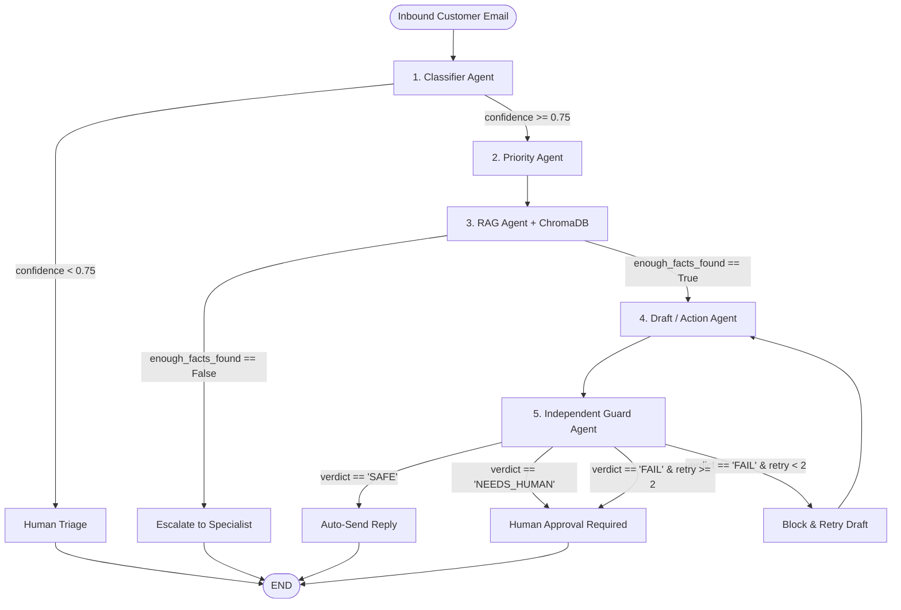

# 📦 Autonomous Logistics Email Support Multi-Agent System

An end-to-end multi-agent email triage, urgency scoring, policy retrieval (RAG), response drafting, and safety auditing system built with **Claude 3.5 Sonnet (`claude-sonnet-4-6`)**, **LangGraph**, **ChromaDB**, and **Streamlit**.

---

## 🚀 Architecture Overview



---

## 🤖 The 5 Specialized Agents

1. **Classifier Agent (`classifier_agent.py`)**:
   - Analyzes incoming emails and outputs JSON containing `category`, `intent`, `awb` tracking number, `sentiment`, and `confidence` score (0-1).
   - Categories: `tracking_query`, `delay_complaint`, `damage_or_loss_claim`, `booking_or_quote_request`, `billing_or_invoice`, `documents_or_customs`, `other`.

2. **Priority Agent (`priority_agent.py`)**:
   - Scores urgency (0-100) using goods type, delay length, urgent language, customer tier, and penalty risk.
   - Assigns SLA tiers: `P1` (>=75, 15 min), `P2` (50-74, 1 hr), `P3` (25-49, 4 hr), `P4` (<25, 24 hr).

3. **RAG / Research Agent (`rag_agent.py`)**:
   - Indexes company policies (`delay_policy.txt`, `damage_claims.txt`, `faq.txt`) into **ChromaDB** using `sentence-transformers` (`all-MiniLM-L6-v2`).
   - Retrieves live shipment status from a mock tracking tool when an Air Waybill (AWB) is present.
   - Extracts grounded facts with source citations.

4. **Draft / Action Agent (`draft_agent.py`)**:
   - Generates professional, polite customer responses strictly referencing verified ground-truth facts.
   - Proposes operational actions only from an approved whitelist: `["reply_only", "create_ticket", "reschedule_delivery", "raise_damage_claim", "request_refund_review", "escalate_to_manager"]`.
   - Never promises arbitrary refund or discount amounts.

5. **Guard Agent (`guard_agent.py`)**:
   - Independent safety reviewer using a separate context to audit facts match, privacy leaks, polite tone, policy compliance, and prompt injections.
   - Yields deterministic verdicts: `SAFE`, `NEEDS_HUMAN`, or `FAIL`.

---

## 📁 Repository Structure

```
├── app.py                      # Streamlit Interactive Web Dashboard
├── orchestrator.py             # LangGraph Workflow & StateGraph Engine
├── run_demo.py                 # CLI Test Runner for Sample Emails
├── classifier_agent.py         # Classifier Agent Module
├── priority_agent.py           # Priority Agent Module
├── rag_agent.py                # RAG & ChromaDB Agent Module
├── draft_agent.py              # Draft / Action Agent Module
├── guard_agent.py              # Guard Safety Reviewer Module
├── requirements.txt            # Project Dependencies
├── policies/
│   ├── delay_policy.txt        # Logistics Delay & SLA Policy
│   ├── damage_claims.txt       # Cargo Damage & Loss Claim Guidelines
│   └── faq.txt                 # Customs Clearance & Demurrage FAQ
├── data/
│   └── sample_emails.json      # 5 Realistic Multi-Scenario Test Emails
└── tests/
    ├── test_classifier_agent.py
    ├── test_priority_agent.py
    ├── test_rag_agent.py
    ├── test_draft_agent.py
    ├── test_guard_agent.py
    └── test_orchestrator.py
```

---

## 🛠️ Installation & Setup

1. **Clone the repository:**
   ```bash
   git clone https://github.com/your-username/logistics-ai-support.git
   cd logistics-ai-support
   ```

2. **Install dependencies:**
   ```bash
   pip install -r requirements.txt
   ```

3. **(Optional) Set Anthropic Claude API Key:**
   ```bash
   # Windows PowerShell:
   $env:ANTHROPIC_API_KEY="your-api-key-here"

   # Linux/macOS:
   export ANTHROPIC_API_KEY="your-api-key-here"
   ```
   *(Note: The system includes a built-in smart simulation fallback, so it can run demonstrations even without an active API key!)*

---

## 🖥️ Running the Application

### 1. Launch the Streamlit Web Dashboard
```bash
streamlit run app.py
```
Visit `http://localhost:8501` to view the inbox feed, inspect agent reasoning traces, approve/edit drafts, and submit live test emails.

### 2. Run the CLI Test Suite
```bash
python run_demo.py
```

### 3. Run Automated Unit Tests (39 Tests)
```bash
pytest -v
```
